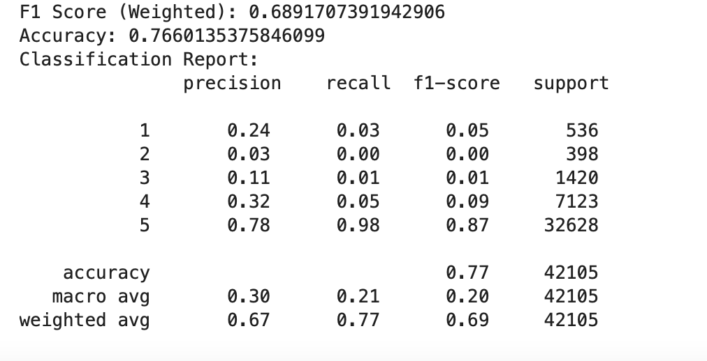

# Investigation on the Relationship Between the Number of Steps and Average Rating of Recipes

Authors: Borui Lin, Junshu Xin

## Overview

This is the final project for DSC 80 at UCSD. Using the dataset on recipes and ratings, we plan to investigate the relationship between number of steps in a recipe and the average rating of a recipe

## Introduction 
Food is indispensable to everyone, a healthy eating habit can promote both mental and physical health significantly. Good food not only provides important nutrients, but also brings savory experiences that help us release dopamine that releases stress. For college students, eating at restaurants all the time can be very expensive, but cooking at home can bring delicious food and save a lot of money! To learn how to cook desirable dishes, recipes are important, and we love recipes with higher ratings. Each recipe consists of many factors,  some seems determinant to the rating of a recipe. We wonder if the number of steps of a recipe will affect the rating negatively or positively. The reason why we chose the number of steps is because we are not sure if people favor more or less: too little steps can be stress-free, but the dish may be rough due to the lack of process, while too many steps can be very time consuming and difficult to follow, the dish comes delicate and exquisite.  We are curious about the effect of the number of steps on recipe ratings. To achieve our goal, we analyze based on two datasets, recipes and ratings, from food.com. 
The first dataset, recipe, contains 83782 rows, representing 83872 unique recipes, with 10 columns recording the following information. 
<html lang="en">
<head>
    <meta charset="UTF-8">
    <meta name="viewport" content="width=device-width, initial-scale=1.0">
    <title>Dataset Overview</title>
    
</head>
<body>
    <table>
        <thead>
            <tr>
                <th>Column</th>
                <th>Description</th>
            </tr>
        </thead>
        <tbody>
            <tr>
                <td><code>name</code></td>
                <td>Recipe name</td>
            </tr>
            <tr>
                <td><code>id</code></td>
                <td>Recipe ID</td>
            </tr>
            <tr>
                <td><code>minutes</code></td>
                <td>Minutes to prepare recipe</td>
            </tr>
            <tr>
                <td><code>contributor_id</code></td>
                <td>User ID who submitted this recipe</td>
            </tr>
            <tr>
                <td><code>submitted</code></td>
                <td>Date recipe was submitted</td>
            </tr>
            <tr>
                <td><code>tags</code></td>
                <td>Food.com tags for recipe</td>
            </tr>
            <tr>
                <td><code>nutrition</code></td>
                <td>Nutrition information in the form [calories (#), total fat (PDV), sugar (PDV), sodium (PDV), protein (PDV), saturated fat (PDV), carbohydrates (PDV)]</td>
            </tr>
            <tr>
                <td><code>n_steps</code></td>
                <td>Number of steps in recipe</td>
            </tr>
            <tr>
                <td><code>steps</code></td>
                <td>Text for recipe steps, in order</td>
            </tr>
            <tr>
                <td><code>ingredients</code></td>
                <td>Text for recipe ingredients</td>
            </tr>
            <tr>
                <td><code>n_ingredients</code></td>
                <td>Number of ingredients in recipe</td>
            </tr>
        </tbody>
    </table>
</body>
</html>
The second dataset, interactions, contains 731927 rows and each row contains a review from the user on a specific recipe. The columns it includes are:
<html lang="en">
<head>
    <meta charset="UTF-8">
    <meta name="viewport" content="width=device-width, initial-scale=1.0">
    <title>Dataset Overview</title>
    
</head>
<body>
    <table>
        <thead>
            <tr>
                <th>Column</th>
                <th>Description</th>
            </tr>
        </thead>
        <tbody>
            <tr>
                <td><code>user_id</code></td>
                <td>User ID</td>
            </tr>
            <tr>
                <td><code>recipe_id</code></td>
                <td>Recipe ID</td>
            </tr>
            <tr>
                <td><code>date</code></td>
                <td>Date of interaction</td>
            </tr>
            <tr>
                <td><code>rating</code></td>
                <td>Rating given</td>
            </tr>
            <tr>
                <td><code>review</code></td>
                <td>Review text</td>
            </tr>
        </tbody>
    </table>
</body>
</html>

Given these two datasets, we are able to begin our project. 

## Data Cleaning and Exploratory Data Analysis

### Data Cleaning
To make future operations easier, we cleaned out datasets through following steps:

1. Left merge the recipes and interactions datasets on `id` and `recipe_id`.
The merge matches each unique recipe with their rating and review

2. Check data types of all the columns after merging.
This step make sure that all variables are in desired data types and if not, we need convert data type to what we want.

<html lang="en">
<head>
    <meta charset="UTF-8">
    <meta name="viewport" content="width=device-width, initial-scale=1.0">
    
</head>
<body>
    <table>
        <thead>
            <tr>
                <th>Column</th>
                <th>Description</th>
            </tr>
        </thead>
        <tbody>
            <tr>
                <td>name</td>
                <td>object</td>
            </tr>
            <tr>
                <td>id</td>
                <td>int64</td>
            </tr>
            <tr>
                <td>minutes</td>
                <td>int64</td>
            </tr>
            <tr>
                <td>contributor_id</td>
                <td>int64</td>
            </tr>
            <tr>
                <td>submitted</td>
                <td>object</td>
            </tr>
            <tr>
                <td>tags</td>
                <td>object</td>
            </tr>
            <tr>
                <td>nutrition</td>
                <td>object</td>
            </tr>
            <tr>
                <td>n_steps</td>
                <td>int64</td>
            </tr>
            <tr>
                <td>steps</td>
                <td>object</td>
            </tr>
            <tr>
                <td>description</td>
                <td>object</td>
            </tr>
            <tr>
                <td>ingredients</td>
                <td>object</td>
            </tr>
            <tr>
                <td>n_ingredients</td>
                <td>int64</td>
            </tr>
            <tr>
                <td>user_id</td>
                <td>float64</td>
            </tr>
            <tr>
                <td>recipe_id</td>
                <td>float64</td>
            </tr>
            <tr>
                <td>date</td>
                <td>object</td>
            </tr>
            <tr>
                <td>rating</td>
                <td>float64</td>
            </tr>
            <tr>
                <td>review</td>
                <td>object</td>
            </tr>
        </tbody>
    </table>
</body>
</html>

3.  Replace all 0 in the `rating` column to np.nan
Rating score ranges from 1 to 5. The lowest possible rating is 1, so if there is an 0, that means no review was ever made for the recipe. It is important to specify this because it will affect the result significantly and will make our model biased.

4. Add a column called `average_rating` to capture the average rating per recipe.
Since each recipe can have multiple ratings from different users, calculating the average rating provides a more comprehensive view of the overall quality and reception of a given recipe.

5.  Add a new column called `years_since_submission` that extract the number of years the data each recipe released until current.
The `submitted` column, which originally stores submission dates as strings, was converted into a proper datetime format to enable time-based calculations. From this, we created a new column, `years_since_submission`, which calculates the number of years since each recipe was originally submitted. This was done by subtracting the submission date from the current date and converting the result into years.
The primary motivation for creating this column is that more recent reviews tend to be stricter or more critical, potentially due to evolving user expectations or higher standards for recipes. We hypothesize that the time since submission could play an important role in predicting recipe ratings. For example, older recipes may have consistently high ratings due to their established popularity, while newer recipes might face stricter scrutiny. Including `years_since_submission` as a feature allows us to capture this temporal factor and evaluate its contribution to the prediction model.

6. ​​Adding `num_review` Column
We added a new column, `num_review`, to represent the popularity of each recipe. The values for this column were derived by grouping the data by recipe_id and then counting the number of reviews in the review column.
The use of `recipe_id` instead of recipe name ensures accuracy because some recipes may share the same name but have distinct `recipe_ids`. This column provides an important measure of user engagement with each recipe, which can contribute to understanding and predicting recipe ratings.

7. Adding `num_tag` and `prop_fat` Columns

`num_tag`:
The num_tag column was added to count the number of tags associated with each recipe. The original tags column was stored as a string object, which made it difficult to analyze. By converting it back into a list of strings and counting the number of elements in the list, we gained a measure of the breadth of categorization for each recipe. This provides insight into how versatile or diverse a recipe may be based on its tags.

`prop_fat`:
prop_fat is the proportion of fat calories relative to the total calories in a recipe. To calculate this, we used the fat (PDV) value in the nutrition column, dividing it by 100% to convert it into decimal form. Then, we multiplied it by 68 to convert the values to grams of fat, as 68 grams is the 100% daily value (PDV) for fat. The value of 68 grams was obtained from looking at nutrient information of different recipes on food.com and use the gram it has divided by the %dv it has. 
Next, we calculated the number of calories from fat by multiplying the fat grams by 9 since each gram of fat contains 9 calories. Finally, we divided the fat calories by the total calories in the recipe (value at index 0 in the nutrition column) to get the proportion of fat calories relative to the total calories.

This data cleaning step standardizes the fat content of recipes, allowing us to make meaningful comparisons across recipes regardless of their total caloric values. All resulting values are between 0 and 1, facilitating parallel analysis of recipes with varying fat proportions.

### Univariate Analysis
For our univariate analysis, we decided to look at the distribution of our main variable of interest, `n_steps`. The histogram below shows the distribution of the number of steps for all the recipes within our data. We can see that the distribution is right-skewed, and most recipes have less than 20 steps. However, there are a few outliers present and we need to consider them in our further analysis
<iframe
  src="https://boruilin.github.io/Number-of-Step-and-Ratings-in-Recipe/graphs/n_step_hist.html"
  width="800"
  height="600"
  frameborder="0"
></iframe>

### Bivariate Analysis
For our bivariate analysis, we decided to use a scatter plot to examine the relationship between the distribution of n_steps and average ratings. The scatter plot below shows that recipes with fewer than 20 steps are densely distributed, with `ratings` spanning the entire range but concentrated near higher values (4–5)
<iframe
  src="https://boruilin.github.io/Number-of-Step-and-Ratings-in-Recipe/graphs/n_step_rating_scatter.html"
  width="800"
  height="600"
  frameborder="0"
></iframe>

### Interesting Aggregates
The pivot table belows shows the average minutes for each rating category. It is interesting to see that recipes that takes more time does not necessarily means higher ratings in our dataset

| ratings  |   minutes |
|---------:|----------:|
|        1 |   99.6725 |
|        2 |   98.0215 |
|        3 |   87.4976 |
|        4 |   91.585  |
|        5 |  106.924  |

## Assessment of Missingness
Within our merged dataset containing both columns from recipe and interaction, there are 3 columns that contain fair amounts of missing values, they are `ratings`, `reviews`, and `description`. Some other columns such as `user_id` and `name` also contain a few missing values; however, for the purpose of assessing missing values, we will only consider and examine the columns that contain a reasonable amount when determining the missing machisms. 
### NMAR Analysis
First, we will try to determine which of the columns above most likely has a missing mechanism of NMAR, meaning that the missing values are not dependent on anything else but the column itself. After we conducted some logical thinking and empirical testing, we concluded that the `review` column can both be NMAR. `review` is most likely NMAR because many users may avoid writing text reviews due to the effort involved, especially if they have a neutral feeling towards the results. To provide a similar example, when I have a very pleasant experience at a restaurant, I would usually write great reviews and give them a high star rating, but when I only have an average experience, I would not bother to write anything to provide my judgments on rating platforms. Some additional data that we can collect in order to make `review` MAR could be the number of times each recipe is used, since the more often a recipe is used, the more likely that it will have more reviews. 
### Missing Dependency
The column we selected to assess missing dependencies is the `ratings`. Some of the columns we thought `ratings` could be MAR on are `n_steps`, `years_since_submission`, and `minutes`. Therefore, we decided to conduct some permutations using different test statistics for each case to determine their dependencies. In our analysis, we use the significance level of 0.05
#### Does the missingness of `ratings` depend on the `n_steps` column?
We decided to use KS stats as test statistics here, since n_steps is a numeric variable that contains a few outliers. Therefore, it is more appropriate to look at the difference in distributions rather than just the difference in means.
#### **Null**: The missingness of ratings does not depend on the proportion of number of steps for a recipe

#### **Alternative**: The missingness of ratings does depend on the proportion of number of steps for a recipe

#### **Test Statistic**: KS statistic for the group of n_steps for rows with missing ratings and group of n_steps for rows with non-missing ratings

The graph below shows the distribution of n_steps for groups of missing and non-missing ratings respectively
<iframe
  src="https://boruilin.github.io/Number-of-Step-and-Ratings-in-Recipe/graphs/n_step_dist_plot.html"
  width="800"
  height="600"
  frameborder="0"
></iframe>
The histogram below shows the distribution results of running the permutation 1000 times using the test statistic of KS stat
<iframe
  src="https://boruilin.github.io/Number-of-Step-and-Ratings-in-Recipe/graphs/n_step_ks_plot.html"
  width="800"
  height="600"
  frameborder="0"
></iframe>
The p_value we found is **(0.0)** and it is lower than the significance level. So we reject the null hypothesis. The missingness of “ratings” does depend on the ‘n_steps’ column

#### Does the missingness of `ratings` depend on the `years_since_submission` column?
We use TVD as the test statistic in this case since there are only 11 unique values in the “years_since_submission” column and they are ordinal. 
#### **Null**: The missingness of ratings does not depend on the number of years since the recipe was submitted for a recipe

#### **Alternative**: The missingness of ratings does depend on the the number of years since the recipe was submitted for a recipe

#### **Test Statistic**: Total Variance Distance for the group of years since submission for rows with missing ratings and group of years since submission for rows with non-missing ratings

The graph below shows the distribution of years since submission for groups of missing and non-missing ratings respectively
<iframe
  src="https://boruilin.github.io/Number-of-Step-and-Ratings-in-Recipe/graphs/years_dist_plot.html"
  width="800"
  height="600"
  frameborder="0"
></iframe>

The histogram below shows the distribution results of running the permutation 1000 times using the test statistic of TVD

<iframe
  src="https://boruilin.github.io/Number-of-Step-and-Ratings-in-Recipe/graphs/years_since_submission_tvd_plot.html"
  width="800"
  height="600"
  frameborder="0"
></iframe>

The p_value we found is **(0.0)** and it is lower than the significance level. So we reject the null hypothesis. The missingness of `ratings` does depend on the `years_since_submission` column

#### Does the Missingness of `ratings` Depend on the `minutes` Column?
We decided to use the absolute difference in means as the test statistic here because minutes is a numeric variable, and we aim to determine if the average cooking time differs significantly between recipes with and without ratings. This approach focuses on central tendency differences rather than distributional shifts.
#### **Null**: The missingness of ratings does not depend on the average minutes for a recipe.

#### **Alternative**: The missingness of ratings depends on the average minutes for a recipe.

#### **Test Statistic**: The absolute difference in means for minutes between rows with missing ratings and rows with non-missing ratings.

The graph illustrates the permutation distribution of the absolute difference in means for `minutes`, with the observed value marked as a red line for comparison
<iframe
  src="https://boruilin.github.io/Number-of-Step-and-Ratings-in-Recipe/graphs/abs_diff_means_minutes_plot.html"
  width="800"
  height="600"
  frameborder="0"
></iframe>

The p_value we found is **(0.12)** and it is higher than the significance level. So we fail to reject the null hypothesis. The missingness of `ratings` does not depend on the ‘minutes’ column

## Hypothesis Testing
In the previous section, we conducted a permutation test and found evidence suggesting that the missingness of 'ratings' is dependent on the number of steps in a recipe. To further investigate the relationship between recipe ratings and the number of steps, we conducted an additional hypothesis test. Specifically, we divided the data based on the median number of steps **(9)**, categorizing recipes with more than 9 steps as `high_steps` and those with 9 or fewer steps as `low_steps`. The goal of this analysis was to determine whether there is a relationship between the average rating of a recipe and its assigned step category. For this test, we used a significance level of 0.05 and performed 1,000 permutations to simulate the null distribution of the test statistic.
Hypotheses

#### **Null**: The average ratings for `high_steps` recipes and `low_steps` recipes are equal.

#### **Alternative**: The average ratings for `high_steps` recipes and `low_steps` recipes are not equal.

#### **Test Statistic**: We used the difference in mean ratings  as the test statistic.

To provide additional context for our null and alternative hypotheses, we considered that both `high_steps` and `low_steps` recipes might offer distinct advantages that could influence their ratings. `high_steps` recipes may receive higher ratings because the increased number of steps could result in more refined and complex flavors. Conversely, `low_steps` recipes might be rated highly due to their simplicity and convenience, which could appeal to users who prioritize ease of preparation. This reasoning motivated us to explore how these potential advantages align with the preferences of users reflected in our collected data.

### Results and Conclusion
The observed difference in mean ratings was **−0.0052**, and the resulting p-value was **0.007**, which is lower than the significance level of 0.05. Since the p-value is small, we reject the null hypothesis and conclude that the average ratings for `high_steps` recipes and `low_steps` recipes are not equal. This result suggests that the step categories do influence the average ratings of recipes in our dataset.

The histogram belows shows the distribution of difference in means of ratings for high steps recipes and low steps recipes

<iframe
  src="https://boruilin.github.io/Number-of-Step-and-Ratings-in-Recipe/graphs/n_steps_diff_means_plot.html"
  width="800"
  height="600"
  frameborder="0"
></iframe>

## Framing a Prediction Problem
Our goal for this project is to predict the rating of a recipe which can be classified to a classification problem even though the ratings are in integer format. They are ordinal categorical variables actually. As our result, we round up the result to an integer so that it is within the range [1,2,3,4,5].  We will build a multi-class classification since there are 5 potential values as outcome.

The reason why we choose to predict the rating of a recipe is because it is the only variable that represents people’s feeling toward it. Aside from rating, all other columns involve only the intrinsic characteristics of a recipe, while rating is truly important to us, and it is usually the first factor that we check. Rating will affect the popularity of the recipe significantly, so we are curious that out of so many factors, what variables have the most profound influence on rating. 

The metric that we will be counting on is F-1 score. We discarded accuracy because we have a very imbalanced dataset, in which more than 72% of the ratings are 5 and more than 88% of the ratings are greater and equal to 4. 

## Baseline Model
Our baseline model is a multiclass classifier that uses the features `n_steps`, `minutes`, and `years_since_submission` to predict the average rating of a recipe (on a scale of 1 to 5). This model can help identify patterns in recipe characteristics that are most associated with high or low ratings, providing insights into recipe popularity and user preferences.
The features are: `n_steps` (quantitative), which represents the number of steps in a recipe; `minutes` (quantitative), indicating the time required to prepare the recipe; and `years_since_submission` (quantitative), which accounts for changes in rating trends over time. These features were chosen because they directly relate to recipe complexity, effort, and relevance over time.

The target variable, average_rating, was converted into integer classes (1–5) to allow for classification. The baseline model achieved an F1 score (weighted) of 0.6751. However, the F1 score was only positive for the prediction rating of 5. This performance suggests that the baseline model provides a modest starting point for predicting recipe ratings but may require further refinement through feature engineering or hyperparameter tuning.

The image belows show the F1 scores of each rating categories prediction

## Final Model
In our final model, we made several adjustments to improve performance and address class imbalance. First, we added three new features: `num_tags`, `prop_fat`, and `num_review`. These features were selected because we believed they would have meaningful relationships with recipe ratings. For example, num_tags provides insight into how descriptive the recipe is, while total_fat and num_review capture nutritional and popularity aspects that may influence user ratings.

To handle multicollinearity in the dataset, we dropped the minutes column because it was strongly correlated with n_steps. Removing this feature ensured that the model focused on independent relationships between features and the target variable. Additionally, we eliminated outliers in the `n_steps` column by applying Z-score filtering, retaining only rows within a range of ±2.5 standard deviations. This step reduced noise in the data and helped the model generalize better.

For the model itself, to address class imbalance in the target variable (rating), we applied SMOTE (Synthetic Minority Oversampling Technique) to oversample minority classes in the training data. This ensured that the model had sufficient representation from all rating categories. Furthermore, we tuned key hyperparameters, such as increasing the number of estimators to 300 and setting a maximum depth of 20. These adjustments improved the model's ability to capture complex patterns while preventing overfitting. The parameters for min_samples_split and min_samples_leaf were kept at 2 and 1, respectively, to maintain flexibility in splitting nodes and modeling finer distinctions in the data.

The final model achieved an F1 score of 0.6892 which is a around 1.4 percent improvement from the previous model. Although this improvement might not seem very significant, we were able to adjust our model so it made improvements in F1 scores for the categories of 1-4.  These results demonstrate improvements in balancing precision and recall across all rating categories, reflecting the effectiveness of our feature engineering, outlier removal, and hyperparameter tuning. While there is room for further improvement, our adjustments have resulted in a robust and interpretable model for predicting recipe ratings.

The image belows show the F1 scores of each rating categories prediction

## Fairness Analysis
To assess the fairness of our model, we conducted an analysis by splitting the dataset into two groups based on the median value of the num_review column:

**Group X**: Recipes with a low number of reviews (below the median value of num_review).

**Group Y**: Recipes with a high number of reviews (at or above the median value of num_review).

We used weighted precision as our evaluation metric. Precision was chosen because it measures the proportion of correctly predicted positive cases out of all positive predictions, allowing us to assess the fairness of the model’s performance across the two groups.

**Null Hypothesis**: There is no difference in weighted precision between Group X and Group Y. Any observed difference is due to random chance.

**Alternative Hypothesis**: There is a significant difference in weighted precision between Group X and Group Y.

**Test Statistic**: Difference in weighted precision

To evaluate the statistical significance of the observed difference, we performed a permutation test with 1,000 permutations. The observed difference in weighted precision between Group X and Group Y was approximately 0.016. The p-value, calculated as the proportion of permutations where the shuffled difference was greater than or equal to the observed difference, was found to be **0.0**.So we reject the null hypothesis, and we can conclude that our model is not fair it predicts better precision of one group than the other

The histogram belows shows the distribution of difference in precision for Group X and Group Y
<iframe
  src="https://boruilin.github.io/Number-of-Step-and-Ratings-in-Recipe/graphs/fairness_plot.html"
  width="800"
  height="600"
  frameborder="0"
></iframe>

